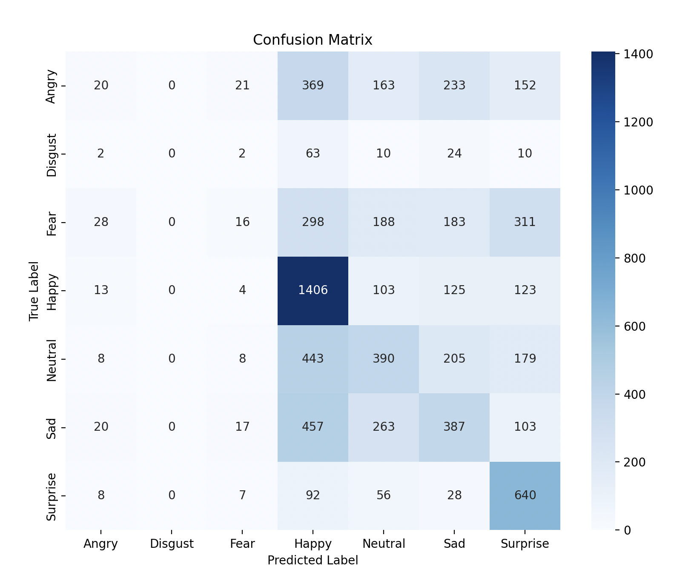
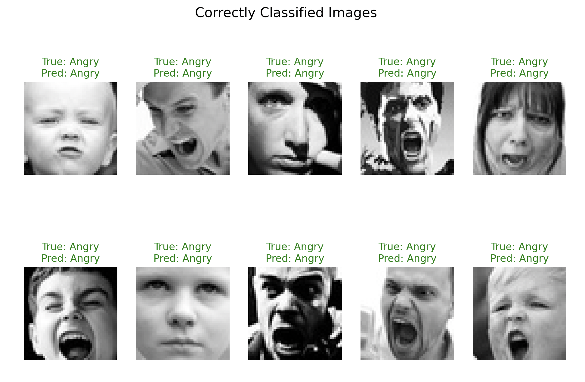
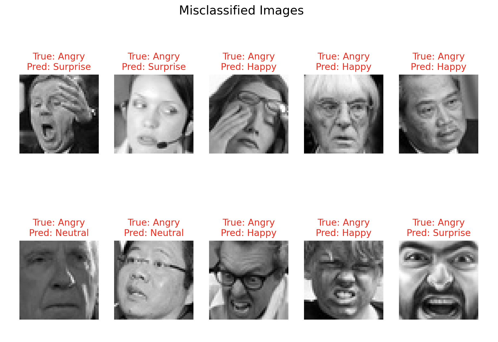

# Emotion Recognition Using CNN

This project is a deep learning-based **Emotion Recognition System** that identifies emotions from grayscale images. It classifies images into one of seven possible emotions:

- **Angry**
- **Disgust**
- **Fear**
- **Happy**
- **Neutral**
- **Sad**
- **Surprise**

The model is built using a **Convolutional Neural Network (CNN)** and the user can interact with it using a simple **Streamlit web application**.

---

## **Features**
- **Image Upload**: Upload any image to predict the emotion.
- **Real-Time Prediction**: The app processes and predicts emotions instantly.
- **Seven Emotion Classes**: The model is trained to recognize the following seven emotions.
- **Interactive Web App**: Streamlit-based web app for a simple and user-friendly experience.

---

## **Project Structure**
```
├── streamlit_app.py      # Streamlit app for image upload and emotion prediction
├── emotion_cnn_model_v2.h5  # Pre-trained model file
├── README.md             # Project documentation
```

---

## **Usage**
visit:https://emotiontracer-gcnunrfu2dm9ybualqdthn.streamlit.app/

### OR
1. **Run the Streamlit App**
   ```bash
   streamlit run streamlit_app.py
   ```

2. **Upload an Image**
   - Click the "Upload an image" button and choose an image file (JPG, JPEG, or PNG).

3. **View the Results**
   - The app will predict the emotion in the image and display the emotion name and confidence score.

---

## **How It Works**

1. **Image Preprocessing**
   - Converts the image to grayscale.
   - Resizes the image to **48x48 pixels**.
   - Normalizes pixel values to the range [0, 1].

2. **Prediction**
   - The pre-trained CNN model predicts the probability of each of the seven emotions.
   - The emotion with the highest probability is selected as the predicted emotion.

---

## **Technologies Used**
- **Python**: Core programming language.
- **TensorFlow/Keras**: Used to create and train the CNN model.
- **Streamlit**: For building the interactive web application.
- **Pillow (PIL)**: For image processing.

---

## **Requirements**
Install the following packages:
- **streamlit**
- **tensorflow**
- **numpy**
- **pillow**

---

## **Model Details**

- **Input**: Grayscale images of size **48x48**
- **Architecture**: Convolutional Neural Network (CNN) with multiple Conv2D, MaxPooling, BatchNormalization, and Dropout layers.
- **Classes**: 7 emotion classes: Angry, Disgust, Fear, Happy, Neutral, Sad, and Surprise.

---

## **Results**

### **Test Accuracy**
The model achieved a **Test Accuracy: 39.83%**.

### **Confusion Matrix**
Below is the confusion matrix showcasing the model's performance:



### **Correctly Classified Images**
These are examples of images where the model correctly identified the emotion **Angry**:



### **Misclassified Images**
These are examples of images where the model misclassified the emotion **Angry** as other emotions:



- The confusion matrix shows that **Angry** is frequently confused with **Surprise** and **Happy**, suggesting overlap in visual cues for these emotions.
- Despite these misclassifications, the model performs well for most images.
- In defence of poor accuracy i can say proudly say I myself would have made the same mistakes.

---

## **Dataset Source**
The dataset used for training and evaluation can be found here: [FER2013 on Kaggle](https://www.kaggle.com/datasets/msambare/fer2013/data)

---

## **Contact**
Feel free to contact me regarding any improvements, issues and errors.
**Happy Coding**.

